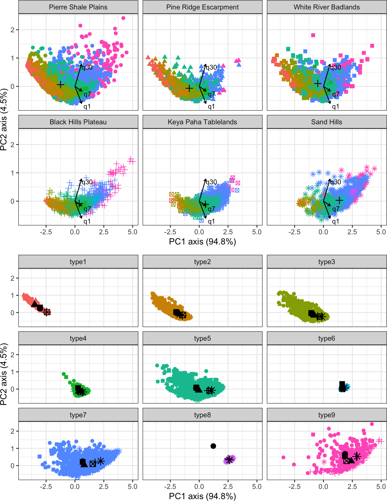
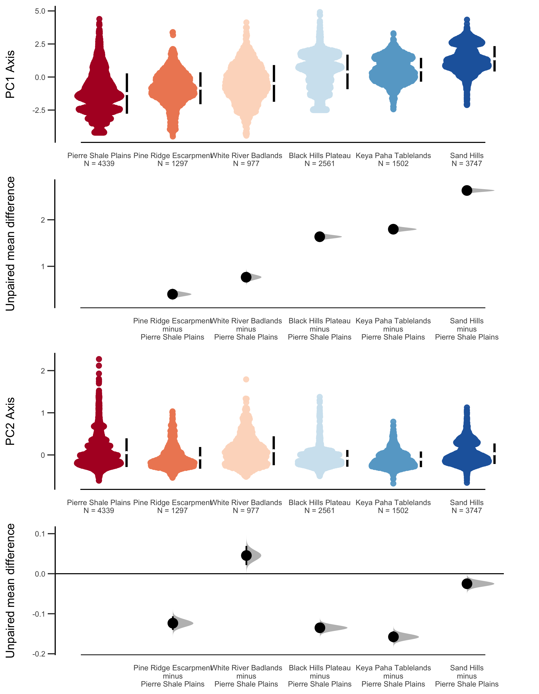
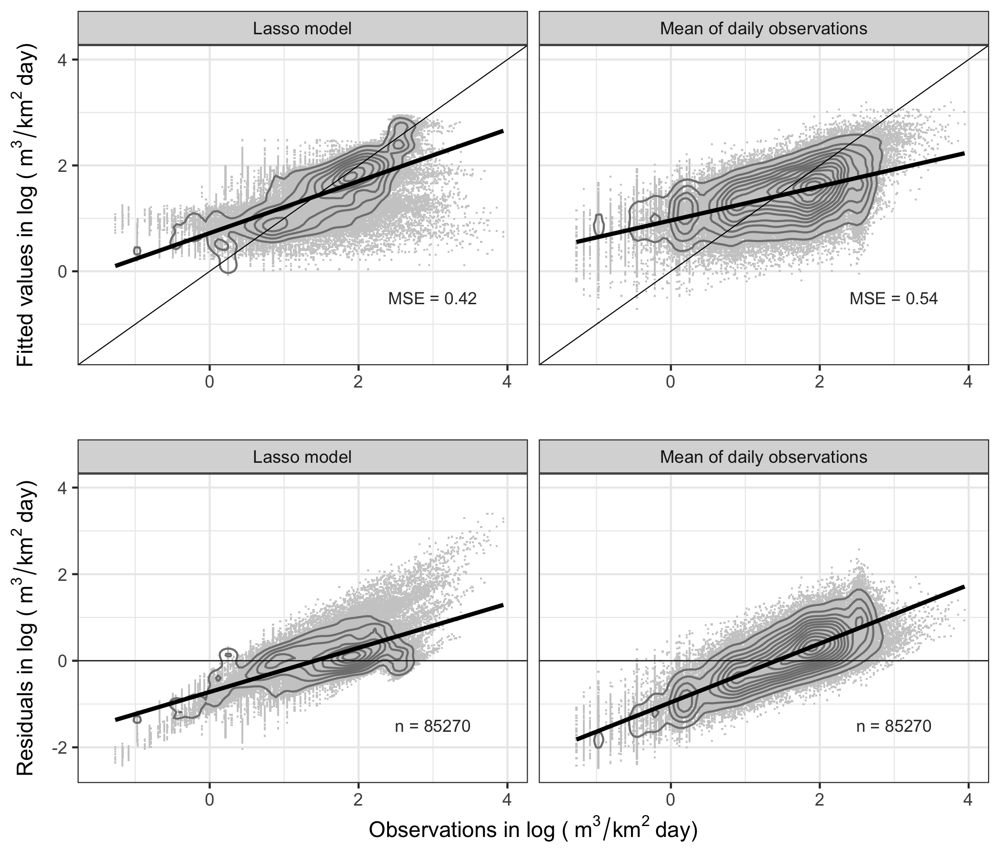
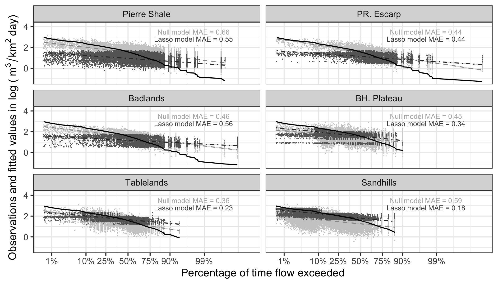

---
author:
- Charles Jason Tinant - STEM Department, Oglala Lakota College
- Scott J. Kenner Department of Civil Engineering Dept, SD Mines
date: "`r Sys.Date()`"
institute:
- ^1^
- ^2^.
output:
  ioslides_presentation:
    css: shiny-slides.css
    incremental: no
    logo: data/peec_meatball.png
    self_contained: no
  beamer_presentation:
    incremental: no
subtitle: Watershed storage parameters improve streamflow estimation accuracy for
  ungaged watersheds for a semiarid region of the Northern Great Plains, USA
---

<!--
output: 
  ioslides_presentation:
    css: shiny-slides.css
    logo: data/peec_meatball.png
    self_contained: no
    incremental: false 
--> 

```{r setup_&_library, message=FALSE, warning=FALSE, include=FALSE}  
  
knitr::opts_chunk$set(echo = FALSE)   
options(tibble.print_max = 70) # sets tibble output for printing       
  
# Set up the library of packages----     
library("conflicted")        # An alternative conflict resolution  strategy  
library("here")              # identifies where to save work  
library("rio")               # more robust I/O - to import and clean data  
library("cowplot")           # features for creating publication-quality figs  
library("magrittr")          # a forward-pipe operator for R  
library("magick")            # advanced graphics and image-processing in R  
library("tidyverse")         # harmonious data munging and visualization in R  
library("kableExtra")  
  
# resolve conflicts among package====  
conflict_prefer("filter", "dplyr")  
  
# cool tips====  

# switch among tabs using ctrl/alt/< or >  

# use this to convert from HTML to pdf (works sometimes)  
#pagedown::chrome_print(  
#  "/Users/cjtinant/index/Eco-drought/presentations/trs_2019/trs2019_tinant.html")  
  
# another approach  
#library(webshot)  
#library(rmarkdown)  
#rmdshot("/Users/cjtinant/index/Eco-drought/presentations/trs_2019/tinant_ioslides.Rmd", "/Users/cjtinant/index/Eco-drought/presentations/trs_2019/trs2019_tinant_ioslides.pdf")  
``` 

# Let's get started...

"Finding your bug is a process of confirming the many things that you believe are true — until you find one which is not true." -- Norm Matloff  

## Research Motivation  

* **A majority of streams** on the *Pine Ridge and Rosebud reservations* in SW South Dakota **lack streamflow records**.

* Watersheds in the region seem to differ by **watershed storage** -- which is  *difficult to measure directly* and *varies in time and space*.  

* **Top-down modeling approaches** might be a useful approach for *watershed classification* and *hydrologic parameter identification*.  

* **Broad research purpose** is to *extend short station records* and **estimate streamflow for ungaged watersheds** for the region.  

<!-- 
* **Watershed storages** may provide *useful metrics* to improve streamflow estimates.  

* **Modeling** watershed storages is necessary because *storages vary in time and space* and are difficult to measure. 

## Outline  
- Study Area Description  
- Methods  
- Results  
- Key Findings  
- Next Steps  
-->  

## Description of study area & data  
- SW South Dakota and NW Nebraska - semi-arid mid-latitude climate (BSk) -- wet springs, hot summers, dry cold winters. 
- USGS stream gage (N = 42) records -- non-karstic sedimentary watersheds -- no dams -- for water years 1980-2018.

```{r studyarea, fig.height=4}
 
# import stream gage data====  
wsd_summary <- import("data/wsd_summary.csv") %>% 
  rename(sta = sta_id) 
 
gage_full <- import("data/gage_mon_full.csv")  
 
# identify complete stations for plotting====  
gage_full <- semi_join(wsd_summary, gage_full,  
                            by = "sta") %>%  
  mutate(complete = "yes") %>%  
  mutate(type = "gaged") %>%  
  select(sta, type, complete)  
 
wsd_summary <- full_join(wsd_summary, gage_full, 
                          by = c("type", "sta") 
                          ) %>% 
  select(sta,  
         type,  
         complete,  
         dec_lat,  
         dec_lon, 
         ecoreg 
         ) %>%   
  mutate(type2 = case_when(  
    complete   == "yes" ~ "complete",  
    type       == "gaged" ~ "incomplete", 
    TRUE ~ type 
    ))  %>% 
  select(-c(complete, type)) %>% 
  rename(type = type2) %>% 
  mutate(ecoreg = case_when(  
    ecoreg == "" ~ "ungaged",  
    TRUE ~ ecoreg)  
    ) %>% 
  # remove ungaged stations 
  filter(type != "ungaged") 
 
rm(gage_full) 
 
# prepare map elements----  
 
# Define the study area using data from the 'maps' package-----   
# import polygon data for maps====   
usa            <- map_data("usa")    
states         <- map_data("state")   
counties       <- map_data("county")   
   
# filter counties for mapping====  
#   need to filter counties for SD & NE separately because of duplicate vals   
#   subset SD counties####   
counties_sd <- subset(counties,  
                      region %in%   
                        c("south dakota"))  
     
counties_sd <- subset(counties_sd,  
                      subregion %in%  
                        c("butte",  
                          "meade",  
                          "lawrence",  
                          "pennington",  
                          "custer",  
                          "fall river",  
                          "shannon",  
                          "jackson",  
                          "bennett",  
                          "haakon",    
                          "todd",     
                          "mellette",  
                          "jones",  
                          "stanley",  
                          "lyman",  
                          "tripp",  
                          "hughes",  
                          "ziebach",  
                          "dewey",  
                          "hughes",  
                          "sully",   
                          "potter"     
                        )  
)    
   
#   subset NE counties####  
counties_ne <- subset(counties,   
                      region %in%  
                        c("nebraska"))  
   
counties_ne <- subset(counties_ne,   
                      subregion %in%  
                        c("sioux",   
                          "dawes",   
                          "sheridan",   
                          "box butte",    
                          "cherry",  
                          "brown",   
                          "keya paha",    
                          "rock"        
                        )   
)   
    
#   join SD & NE counties####   
counties <- bind_rows(counties_sd, counties_ne)  
rm(counties_sd, counties_ne)   
 
# create SD-NE & SD-WY lines====   
ne_bound <- subset(counties,   
                   subregion %in%     
                     c("fall river",   
                       "shannon",  
                       "bennett",   
                       "todd",   
                       "tripp")) %>%  
  filter(lat < 43.1)      
  
wy_bound <- subset(counties,   
                   subregion %in%  
                     c("butte",      
                       "lawrence"  ,  
                       "pennington" ,  
                       "custer",      
                       "fall river",  
                       "sioux"  
                     )) %>%  
  filter(long < -104)  
     
# create Reservation counties==== 
rez <- subset(counties,   
                   subregion %in%  
                     c("shannon",      
                       "bennett"  ,  
                       "jackson", 
                       "mellette", 
                       "todd", 
                       "dewey", 
                       "ziebach" 
                     )) 
 
ridge_bound <- subset(counties,   
                   subregion %in%  
                     c("shannon",      
                       "bennett"  ,  
                       "jackson") 
                   )  

rosebud_bound <- subset(counties,   
                   subregion %in%  
                     c("mellette", 
                       "todd") 
                       ) 

# plot US map as a grob----   
# create a bounding box -- order is SW, NW, NE, SE====    
bbox <- tibble(lat = c(42.0, 45.0, 45.0, 42.0),  
               long = c(-104.5, -104.5, -99.5, -99.5),  
               group = c(1, 1, 1, 1)  
)  
  
# plot US map====     
usmap <- ggplot() +  
  geom_polygon(data = usa,  
               aes(x=long, y = lat, group = group),   
               fill = "gray70",  
               color = "gray70"  
  ) +       
  coord_fixed(1.3) +  
  theme_nothing() +  
  geom_polygon(data = bbox,  
               aes(x=long, y = lat, group = group),  
               fill = "gray30",  
               color = "gray30") +   
  xlab("") +   
  ylab("")   
     
# change the US map into a grob####   
usmap <- as_grob(usmap, device = NULL)  
  
rm(usa)  
  
# plot  station map====    
# Legend.position can be a numeric vector c(x,y), where x and y are the   
#   coordinates of the legend box between 0 and 1.  
#     c(0,0) corresponds to the “bottom left” and   
#     c(1,1) corresponds to the “top right” position.  
  
ggplot() +   
  theme_classic() +  
  coord_fixed(1.3) +  
  xlab("") +    
  ylab("") +      
  theme(axis.line         = element_line(colour = "grey60")) +  
  theme(axis.ticks        = element_line(colour = "grey60")) +  
  theme(axis.text         = element_text(colour = "grey50")) +  
  theme(legend.position   = c(1.1, 0.4)) +    
  theme(legend.title      = element_text(size = 10)) +   
  theme(legend.text       = element_text(size = 8)) +  
  theme(legend.key.height =  unit(0.5, 'cm')) +  
  guides(shape            = guide_legend(order = 1),  
         color            = guide_legend(order = 2)  
  ) +     
  # add counties      
  geom_polygon(data      = counties,   
               aes(x     = long,  
                   y     = lat,     
                   group = group),   
               color     = "gray80",  
               fill      = "NA") +   
  # add Reservation counties 
  geom_polygon(data = rez,   
               aes(x     = long,  
                   y     = lat,    
                   group = group),  
               fill     = "gray90", 
               alpha = 0.5
  ) + 
  # add Pine Ridge boundary 
  geom_polygon(data = ridge_bound,   
               aes(x     = long,  
                   y     = lat,    
                   group = group),  
               color     = "gray50",  
               fill     = "NA" 
  ) + 
  # add Pine Ridge boundary 
  geom_polygon(data = rosebud_bound,   
               aes(x     = long,  
                   y     = lat,    
                   group = group),  
               color     = "gray50",  
               fill     = "NA" 
  ) + 
  # add NE stateline boundary    
  geom_line(data      = ne_bound,   
            aes(x     = long,    
                y     = lat,     
                group = group),  
            color     = "gray60"  
  ) +   
  #   # add WY stateline boundary    
  geom_line(data = wy_bound,   
            aes(x     = long,  
                y     = lat,    
                group = group),  
            color     = "gray60"    
  ) +    
  # add stream gaging stations     
  geom_point(data      = wsd_summary,  
             aes(dec_lon,  
                 dec_lat,   
                 color = factor(wsd_summary$type),  
                 shape = factor(wsd_summary$ecoreg),
             ),   
             size     = 2,    
             stroke   = 0.8,  
  ) +      
  # create legend elements  
  scale_shape_discrete(   
    name       = 'Ecoregion type',   
    guide      = 'legend'
  ) +   
scale_colour_hue(name    = 'Gage length',
                 h.start = 180, # sets red as incomplete gage record
                 guide   = 'legend') +   
  # add the US map as a grob    
  annotation_custom(grob = usmap,    
                    xmin = -99.3,    
                    xmax = -97.4,   
                    ymin = 44.5,   
                    ymax = 45.5)    
 
# clean up global environment 
rm(bbox,   
   counties,   
   states,   
   wsd_summary,  
   ne_bound,  
   wy_bound, 
   usmap,  
   rez, 
   ridge_bound, 
   rosebud_bound
)    
 
```

## Classification approach
- Box-Cox transform of daily (q1), 7-day (q7) and 30-day (q30) flow depths.  

- **Unsupervised classification** using a finite mixture model (Fraley 2016).  

- **Supervised classification**  by a bias-corrected and accelerated bootstrapping by ecoregion (DiCiccio, Thomas, and Bradley Efron, 1996).

## Finite mixture model classification  
<!-- 
code below sets up a two-panel format  
-->  
  
<div class='left' style='float:left;width:43%'>  
- Soft clusters identified streamflow 'type'.  
- Type-1 ~ low flows ~ correlates with q1 and q7;  
- Type-9 ~ high flows ~ correlates with q30.  
- **Lots of overlap**, note increasing hydrologic export among ecoregions...
- *X-axis ~ hydrologic export and Y-axis ~ streamflow evenness (q30 - q1)*.  
</div>  
  
<div class='right' style='float:right;width:55%'>  
```{r mclust, echo=FALSE,  out.width='91%'}
  
  
```
</div>  
  
## Bootstrapped estimates by ecoregion  
  
<div class='left' style='float:left;width:48%'>  
- **Hydrologic export** (PC1) among ecoregions are **significantly different at the 95% CI**.  
- **Evenness** (PC2) groups into low evenness (e.g. 'flashy' watersheds) and high evenness watersheds.  
- Note: *Sandhills* watersheds are *both high-export and high-evenness* ~ also two modes.  
- **New question**--what are driving clustering results?  
</div>  
  
<div class='right' style='float:right;width:48%'>  
```{r bootstrap, echo=FALSE,  out.width='95%'}


```
</div>  

## Generalized Linear Models (GLMs) 

<div class='left' style='float:left;width:60%'>  
- **Trained GLMs** ~ 80/20 split, 5-fold cross-validation, selected best-fit model, fitted holdout data, and evaluated against a null model of mean daily flow depths.  

- *Response variable* = log(q1).  
- *Explanatory variables* = hydrologic landscape metrics, ecoregion, seasonality, trend.  
  
- **Hydrologic landscape metrics for GLM input** ~ derived as zonal statistics of 30m input rasters (N=15 metrics).  
</div>  
  
<div class='right' style='float:right;width:40%'>  
```{r obs_fit, echo=FALSE,  out.width='95%', fig.cap="Results - GLM and null models overpredict low flows and underpredict high flows. Ecoregion and hydrologic conductivity are key drivers of GLMs", out.width = '90%', fig.align='center'}


```
</div>  

```{r glmtable_prep}
 
# prepare table for printing 
glm_table <- import("data/glm_table.csv") %>% 
  filter(!is.na(`Pierre Shale Plains`)) %>% 
  mutate(Transformation = case_when( 
    Transformation == "none" ~ "", 
    TRUE ~ Transformation)) %>% 
 mutate(`Explanatory variable` = case_when( 
    `Explanatory variable` == "Intercept" ~ "Intercept", 
    `Explanatory variable` == "perc_cov"   ~ "Percent cover", 
    `Explanatory variable` == "kvert_mean" ~ "Hydrologic conductivity",
    `Explanatory variable` == "summer"     ~ "Summer proximity", 
    `Explanatory variable` == "spring"     ~ "Spring proximity", 
    `Explanatory variable` == "year"       ~ "Year", 
    `Explanatory variable` == "cat_area"   ~ "Watershed area",
    `Explanatory variable` == "drain_dens" ~ "Drainage density", 
    `Explanatory variable` == "slop_med"   ~ "Watershed slope",
    `Explanatory variable` == "drain_dens" ~ "Drainage density",
    `Explanatory variable` ==  "lw_ratio"  ~ "Watershed length to width ratio", 
    `Explanatory variable` ==  "cat_out"   ~ "Watershed outlet elevation", 
    TRUE ~ Transformation)) 

```

## GLM regression results | Key variables ~ ecoregion & hydrologic conductivity
```{r print_glmtable, out.width='70%', }
 
# prepare to print NA values as blank 
options(knitr.kable.NA = '') 
 
# print table with the following options:  
#   kable_styling to change font 
#   add a second header -- total of add_header_above = # variables 

knitr::kable(glm_table, 
             align = 'c',"html") %>% 
  kable_styling(font_size = 14) %>% 
  add_header_above(c(" " = 2, 
                     "Low Export" = 3, 
                     "Moderate Export" = 2, 
                     "High Export" = 1))
 
``` 

## Flow duration curves | Results indicate temporal differences in watershed storage 
```{r flowDurationPlot, echo=FALSE, fig.cap="  Greater % of time exceeded corresponds with lower q1 depths.", out.width = '85%', fig.align='center'}
 
 
 
```

## Key findings 
- **Hydrologic export to streams depends on watershed storage** ~ watershed storage volume varies by ecoregion and antecedent moisture conditions 

- **Low export watersheds** are *boom and bust* ~ low water capture - drying out during mid-range to dry antecedent moisture conditions. **Low drought resilience streams** 
- **Moderate export watershed** storages active throughout a *wide range* of antecedent moisture conditions ~ **Moderate drought resilience streams**  
- **High export watershed** storages are *excess capacity* ~ attenuating overland flow.  Long-duration floods during high-flow conditions ~ **High drought resilience streams**

## Incorporating research | Meeting Tribal water resource information needs: 
* **Short-record or discontinued gages** ~ incorporate *regionalization by ecoregion* to extend records for flood-frequency analysis ~ partnering with SDSMT to begin in Spring 2000 for Pine Ridge White Clay district.
* **Ungaged watersheds** ~ use nearest gaged stations *selected by ecoregion* for streamflow estimation ~ Incorporation into 44 water quality stations without streamflow for load duration curves to improve water quality.   
* **Stream health metrics** ~ incorporate standardized precipitation indices into macroinvertebrate stream health metrics for EPA 106 & 319 reporting.


<!--
## Discussion 
- Lasso ~ parsimonious & similar performance to Elastic Net and Ridge regression ~ outperformed null model (e.g. lower MAE)
- Overall ~ vertical conductivity was the most important regression parameter
- Ecoregion scale, seasonality and trend were most important parameters 
- Conductivity and shape parameters also important **but differed among ecoregions**
- Conductivity and shape parameters also important **but differed among ecoregions**
3. **The antecedent moisture conditions when watershed storages are active differs by ecoregion.** 
- Low hydrologic export ecoregions have high seasonal and annual dependence. 
- Moderate export ecoregions exhibit moderate seasonal and annual dependence. 
- High export ecoregions exhibit low seasonal and annual dependence.
<div class='left' style='float:left;width:48%'>


## Ecoregion drives hydrologic export
<div class='left' style='float:left;width:40%'>  
1. **Ecoregion drives hydrologic export**. 
2. Ecoregion & **vertical conductivity** covary & are most important parameters
3. Seasonality and annual trend are also important parameters 

</div>  
  
<div class='right' style='float:right;width:60%'>  

```{r flowDurationPlot2, echo=FALSE, out.width = '90%', fig.align='center'}
 
 
 
```

<!-- add figure here -- use tiune series picture
-->
